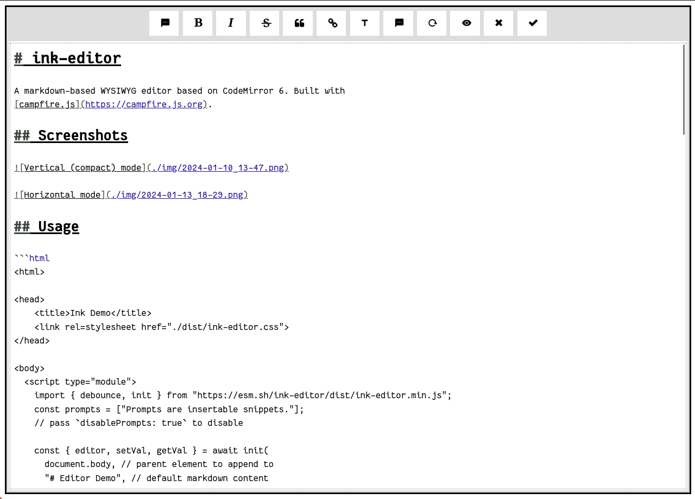

# ink-editor

A markdown-based WYSIWYG editor based on CodeMirror 6. Built with
[campfire.js](https://campfire.js.org).

Try the [demo](https://xyzshantaram.github.io/ink-editor/), or read on for usage
and build information.

## Screenshots




## Usage

```html
<html>

<head>
    <title>Ink Demo</title>
    <link rel=stylesheet href="./dist/ink-editor.css">
</head>

<body>
  <script type="module">
    import { debounce, init } from "https://esm.sh/ink-editor/dist/ink-editor.min.js";
    const prompts = ["Prompts are insertable snippets."];
    // pass `disablePrompts: true` to disable

    const { editor, setVal, getVal } = await init(
      document.body, // parent element to append to
      "# Editor Demo", // default markdown content
      prompts,
      "This string shows when the editor is empty.", // placeholder to use
      {
        autosave: debounce(
          (text) => localStorage.setItem("contents", text), 
        1000),
        retrieve: () => localStorage.getItem('contents'),
        done: (text) => console.log(`done clicked with content ${text}`),
        exit: (_) => console.log("received exit request"),
      }, // other options described below
    );
  </script>
</body>

</html>
```

If you intend on self-hosting, you'll need the `NerdFont-stripped.ttf` and
'writr-editor.css' to be placed in the same dir and inserted in your HTML
document.

### Full list of editor options (`interface EditorOptions`)

<details>
<summary>
Click to expand
</summary>

#### `autosave: (contents: string) => void | Promise<void>`

The function to use for autosaving the document.

#### `retrieve: () => string | Promise<string>`

A function the editor calls to get autosaved content if it is nonempty. Should
return the autosaved content.

#### `doneFn: (text: string) => void | Promise<void>`

Function called when Done is clicked in the editor.

#### `exit: () => void | Promise<void>`

A function called when Exit is clicked in the editor.

#### `width: string` and `height: string`

Width and height of the editor in CSS units.

#### `fontFamily: string`

CSS font family to be used in the editor. Identical to setting font-family via
CSS.

#### `disablePrompts: boolean`

Whether to disable the Prompts feature.

#### `verticalMode: boolean`

Whether to lay out the editor vertically (with controls in a horizontal top bar)
or horizontally (controls go in a sidebar and are hidden on mobile).

#### `parse: (str: string) => string;`

A parsing function, used for the preview feature. Should take in a markdown
string and return an HTML string.

</details>

## Building

```bash
git clone https://github.com/xyzshantaram/ink-editor # clone repo however you like
cd ink-editor
cd fonts # building the icon font
./strip-fonts.sh # needs uni2ascii and pyftsubset
npm install # install deps
npm run build # runs tsc, esbuild, minifies css, copies fonts into the dist/ directory
```

## LICENSE

```md
The MIT License (MIT)

Copyright © 2023 Siddharth Singh

Permission is hereby granted, free of charge, to any person obtaining a copy of
this software and associated documentation files (the “Software”), to deal in
the Software without restriction, including without limitation the rights to
use, copy, modify, merge, publish, distribute, sublicense, and/or sell copies of
the Software, and to permit persons to whom the Software is furnished to do so,
subject to the following conditions:

- The above copyright notice and this permission notice shall be included in all
  copies or substantial portions of the Software.

THE SOFTWARE IS PROVIDED “AS IS”, WITHOUT WARRANTY OF ANY KIND, EXPRESS OR
IMPLIED, INCLUDING BUT NOT LIMITED TO THE WARRANTIES OF MERCHANTABILITY, FITNESS
FOR A PARTICULAR PURPOSE AND NONINFRINGEMENT. IN NO EVENT SHALL THE AUTHORS OR
COPYRIGHT HOLDERS BE LIABLE FOR ANY CLAIM, DAMAGES OR OTHER LIABILITY, WHETHER
IN AN ACTION OF CONTRACT, TORT OR OTHERWISE, ARISING FROM, OUT OF OR IN
CONNECTION WITH THE SOFTWARE OR THE USE OR OTHER DEALINGS IN THE SOFTWARE.
```

A patched Nerd Font is used for icons required for the editor. The license for
that font can be found [here](./fonts/LICENSE).
